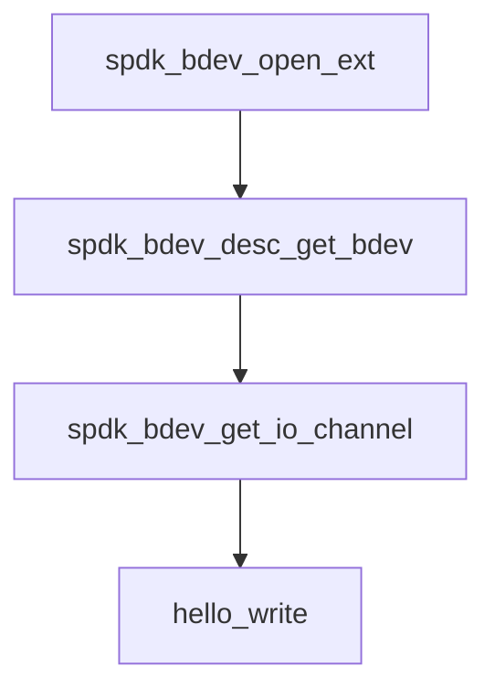

# 实验三 bdev原理和源码分析

## **一、实验目的**

1. 学习bdev原理和基本操作接口。

## **二、实验内容**

1. 配置bdev运行环境

2. 运行hello_bdev程序并分析源码

3. 通过bdev接口写入数据并读取

## **三、实验代码及结果**

### 1）注意事项

**注意：后续实验需要在`NVME`环境下启动，使用如下命令启动**

```
sudo qemu-system-x86_64 -name qemucsd -m 8G -cpu qemu64,+ssse3,+sse4.1,+sse4.2 -smp 4 \
-hda ./ubuntu.qcow2 \
-net user,hostfwd=tcp:127.0.0.1:7777-:22,hostfwd=tcp:127.0.0.1:2222-:2000 -net nic \
-drive file=nvme.qcow2,if=none,id=nvm \
-device nvme,serial=deadbeef,drive=nvm
```

若使用znssd启动实验，会一直显示无法查找到`Nvme0n1`设备，该bug经过查询`github`上的`issue`暂未找到解决办法。


### 2）`bdev`的`hello_world`测试

首先需要初始化环境

```
sudo scripts/setup.sh
```


运行如下命令，生成配置文件

```
./scripts/gen_nvme.sh --json-with-subsystems > ./build/examples/nvme.json
```


运行`bdev`的`hello_world`程序

```
cd build/examples/
sudo ./hello_bdev -c nvme.json -b Nvme0n1
```


### 3）`hello_bdev.c`源码分析

主函数：

```
int main(int argc, char **argv)
{
    struct spdk_app_opts opts = {};
    int rc = 0;
    struct hello_context_t hello_context = {};
 
    /* Set default values in opts structure. */
    spdk_app_opts_init(&opts, sizeof(opts));
    opts.name = "hello_bdev";
 
    /*
     * Parse built-in SPDK command line parameters as well
     * as our custom one(s).
     */
    if ((rc = spdk_app_parse_args(argc, argv, &opts, "b:", NULL, hello_bdev_parse_arg,
                      hello_bdev_usage)) != SPDK_APP_PARSE_ARGS_SUCCESS) {
        exit(rc);
    }
    hello_context.bdev_name = g_bdev_name;
 
    /*
     * spdk_app_start() will initialize the SPDK framework, call hello_start(),
     * and then block until spdk_app_stop() is called (or if an initialization
     * error occurs, spdk_app_start() will return with rc even without calling
     * hello_start().
     */
    rc = spdk_app_start(&opts, hello_start, &hello_context);
    if (rc) {
        SPDK_ERRLOG("ERROR starting applicationn");
    }
 
    /* At this point either spdk_app_stop() was called, or spdk_app_start()
     * failed because of internal error.
     */
 
    /* When the app stops, free up memory that we allocated. */
    spdk_dma_free(hello_context.buff);
 
    /* Gracefully close out all of the SPDK subsystems. */
    spdk_app_fini();
    return rc;
}
```

从代码中的注释，可以看到：

* `spdk_app_opts_init()` 用来初始化一些参数
* `spdk_app_parse_args()` 传入命令行的一些参数和配置文件 (即`-c nvme.json`这种)
* `rc = spdk_app_start(&opts, hello_start, &hello_context)` 载入SPDK框架，调用 `hello_start` 函数，并在调用 `spdk_app_stop()` 后返回状态值
* `spdk_dma_free()` 释放空间
* `spdk_app_fini()` 关闭所有SPDK子系统


下面着重分析`spdk_app_start(&opts, hello_start, &hello_context)`的内容

`spdk_app_start(&opts, hello_start, &hello_context)`的主要任务函数为 `hello_start`，对应源码

```
static void hello_start(void *arg1)
{
    struct hello_context_t *hello_context = arg1;
    uint32_t buf_align;
    int rc = 0;
    hello_context->bdev = NULL;
    hello_context->bdev_desc = NULL;
 
    SPDK_NOTICELOG("Successfully started the applicationn");
 
    /*
     * There can be many bdevs configured, but this application will only use
     * the one input by the user at runtime.
     *
     * Open the bdev by calling spdk_bdev_open_ext() with its name.
     * The function will return a descriptor
     */
    SPDK_NOTICELOG("Opening the bdev %sn", hello_context->bdev_name);
    rc = spdk_bdev_open_ext(hello_context->bdev_name, true, hello_bdev_event_cb, NULL,
                &hello_context->bdev_desc);
    if (rc) {
        SPDK_ERRLOG("Could not open bdev: %sn", hello_context->bdev_name);
        spdk_app_stop(-1);
        return;
    }
 
    /* A bdev pointer is valid while the bdev is opened. */
    hello_context->bdev = spdk_bdev_desc_get_bdev(hello_context->bdev_desc);
 
    SPDK_NOTICELOG("Opening io channeln");
    /* Open I/O channel */
    hello_context->bdev_io_channel = spdk_bdev_get_io_channel(hello_context->bdev_desc);
    if (hello_context->bdev_io_channel == NULL) {
        SPDK_ERRLOG("Could not create bdev I/O channel!!n");
        spdk_bdev_close(hello_context->bdev_desc);
        spdk_app_stop(-1);
        return;
    }
 
    /* Allocate memory for the write buffer.
     * Initialize the write buffer with the string "Hello World!"
     */
    hello_context->buff_size = spdk_bdev_get_block_size(hello_context->bdev) *
                   spdk_bdev_get_write_unit_size(hello_context->bdev);
    buf_align = spdk_bdev_get_buf_align(hello_context->bdev);
    hello_context->buff = spdk_dma_zmalloc(hello_context->buff_size, buf_align, NULL);
    if (!hello_context->buff) {
        SPDK_ERRLOG("Failed to allocate buffern");
        spdk_put_io_channel(hello_context->bdev_io_channel);
        spdk_bdev_close(hello_context->bdev_desc);
        spdk_app_stop(-1);
        return;
    }
    snprintf(hello_context->buff, hello_context->buff_size, "%s", "Hello World!n");
 
    if (spdk_bdev_is_zoned(hello_context->bdev)) {
        hello_reset_zone(hello_context);
        /* If bdev is zoned, the callback, reset_zone_complete, will call hello_write() */
        return;
    }
 
    hello_write(hello_context);
}
```

程序大致流程为：



* `spdk_bdev_open_ext()` ：**Open the bdev by calling** and **return a descriptor**
* `spdk_bdev_desc_get_bdev()` : **A bdev pointer is valid while the bdev is opened**

* `spdk_bdev_get_io_channel()` :**Open I/O channel**
* `hello_context->buff_size=... , hello_context->buff=... , snprintf(...)` : **Allocate memory for the write buffer and Initialize the write buffer with the string "Hello World!"**

* `hello_write`: 调用write函数进行写入


其余剩下的函数为`hello_write`的补充，如`write_complete()` 用来判定是否完成，以及一些读取`hello_read()`和`read_complete()`

### 4）生成256KB字符串数据，修改hello_bdev.c源码将字符串数据通过bdev写入

在源代码的基础上，修改`hello_context_t`以及对应的内容，

```
#include "spdk/stdinc.h"
#include "spdk/thread.h"
#include "spdk/bdev.h"
#include "spdk/env.h"
#include "spdk/event.h"
#include "spdk/log.h"
#include "spdk/string.h"
#include "spdk/bdev_zone.h"
 
static char *g_bdev_name = "Nvme0n1";
 
const int DATA_LENGTH = 256*1024;
 
struct my_context
{
    struct spdk_bdev *bdev;
    struct spdk_bdev_desc *bdev_desc;
    struct spdk_io_channel *bdev_io_channel;
    char *buff;
    uint32_t buff_size;
    char *bdev_name;
    struct spdk_bdev_io_wait_entry bdev_io_wait;
};
 
static char *generate_str(void)
{
    char *str = (char *)malloc(DATA_LENGTH * 8);
    memset(str, 0, DATA_LENGTH*8);
    if (str)
    {
        int i;
        for (i = 0; i < DATA_LENGTH; ++ i)
        {
            str[i] = '0'+(i%10);
        }
        return str;
    }
    else
    {
        return NULL;
    }
}
 
static void save_data(const char *file_path, char *str)
{
    FILE *fp = fopen(file_path, "w");
    fprintf(fp, "%s", str);
    fclose(fp);
}
 
static int bdev_parse_arg(int ch, char *arg)
{
    switch (ch)
    {
    case 'b':
        g_bdev_name = arg;
        break;
    default:
        return -EINVAL;
    }
    return 0;
}
 
static void bdev_usage(void)
{
    printf(" -b <bdev>                 name of the bdev to use\n");
}
 
static void bdev_event_cb(enum spdk_bdev_event_type type, struct spdk_bdev *bdev, void *event_ctx)
{
    SPDK_NOTICELOG("Unsupported bdev event: type %d\n", type);
}
 
static void read_complete(struct spdk_bdev_io *bdev_io, bool success, void *cb_arg)
{
    struct my_context *p = cb_arg;
 
    if (success)
    {
        SPDK_NOTICELOG("Reading Successfully, Saveing to data.out\n");
        save_data("./data.out", p->buff);
    }
    else
    {
        SPDK_ERRLOG("bdev io read error\n");
    }
 
    spdk_bdev_free_io(bdev_io);
    spdk_put_io_channel(p->bdev_io_channel);
    spdk_bdev_close(p->bdev_desc);
    SPDK_NOTICELOG("Stopping app\n");
    spdk_app_stop(success ? 0 : -1);
}
 
static void start_read(void *arg)
{
    struct my_context *p = arg;
    int rc = 0;
 
    SPDK_NOTICELOG("Reading io\n");
    rc = spdk_bdev_read(p->bdev_desc, p->bdev_io_channel, p->buff, 0, p->buff_size, read_complete, p);
 
    if (rc == -ENOMEM)
    {
        SPDK_NOTICELOG("Queueing io\n");
        p->bdev_io_wait.bdev = p->bdev;
        p->bdev_io_wait.cb_fn = start_read;
        p->bdev_io_wait.cb_arg = p;
        spdk_bdev_queue_io_wait(p->bdev, p->bdev_io_channel, &p->bdev_io_wait);
    }
    else if (rc)
    {
        SPDK_ERRLOG("%s error while reading from bdev: %d\n", spdk_strerror(-rc), rc);
        spdk_put_io_channel(p->bdev_io_channel);
        spdk_bdev_close(p->bdev_desc);
        spdk_app_stop(-1);
    }
}
 
static void write_complete(struct spdk_bdev_io *bdev_io, bool success, void *cb_arg)
{
    struct my_context *p = cb_arg;
 
    spdk_bdev_free_io(bdev_io);
 
    if (success)
    {
        SPDK_NOTICELOG("bdev io write completed successfully\n");
    }
    else
    {
        SPDK_ERRLOG("bdev io write error: %d\n", EIO);
        spdk_put_io_channel(p->bdev_io_channel);
        spdk_bdev_close(p->bdev_desc);
        spdk_app_stop(-1);
        return;
    }
 
    memset(p->buff, 0, p->buff_size);
    start_read(p);
}
 
static void start_write(void *arg)
{
    struct my_context *p = arg;
    int rc = 0;
 
    SPDK_NOTICELOG("Writing to the bdev\n");
    rc = spdk_bdev_write(p->bdev_desc, p->bdev_io_channel, p->buff, 0, p->buff_size, write_complete, p);
 
    if (rc == -ENOMEM)
    {
        SPDK_NOTICELOG("Queueing io\n");
        p->bdev_io_wait.bdev = p->bdev;
        p->bdev_io_wait.cb_fn = start_write;
        p->bdev_io_wait.cb_arg = p;
        spdk_bdev_queue_io_wait(p->bdev, p->bdev_io_channel, &p->bdev_io_wait);
    }
    else if (rc)
    {
        SPDK_ERRLOG("%s error while writing to bdev: %d\n", spdk_strerror(-rc), rc);
        spdk_put_io_channel(p->bdev_io_channel);
        spdk_bdev_close(p->bdev_desc);
        spdk_app_stop(-1);
    }
}
 
static void zhp_bdev(void *arg)
{
    struct my_context *p = arg;
    uint32_t buf_align;
    uint32_t block_size;
    int rc = 0;
    p->bdev = NULL;
    p->bdev_desc = NULL;
 
    SPDK_NOTICELOG("Successfully started the application\n");
 
    SPDK_NOTICELOG("Opening the bdev %s\n", p->bdev_name);
    rc = spdk_bdev_open_ext(p->bdev_name, true, bdev_event_cb, NULL, &p->bdev_desc);
    if (rc)
    {
        SPDK_ERRLOG("Could not open bdev: %s\n", p->bdev_name);
        spdk_app_stop(-1);
        return;
    }
 
    p->bdev = spdk_bdev_desc_get_bdev(p->bdev_desc);
 
    SPDK_NOTICELOG("Opening io channel\n");
    p->bdev_io_channel = spdk_bdev_get_io_channel(p->bdev_desc);
    if (p->bdev_io_channel == NULL)
    {
        SPDK_ERRLOG("Could not create bdev I/O channel!!\n");
        spdk_bdev_close(p->bdev_desc);
        spdk_app_stop(-1);
        return;
    }
 
    block_size = spdk_bdev_get_block_size(p->bdev);
    buf_align = spdk_bdev_get_buf_align(p->bdev);
 
    p->buff_size = ceil(1.0*DATA_LENGTH/block_size)*block_size;
    p->buff = spdk_dma_zmalloc(p->buff_size, buf_align, NULL);
    if (!p->buff)
    {
        SPDK_ERRLOG("Failed to allocate buffer\n");
        spdk_put_io_channel(p->bdev_io_channel);
        spdk_bdev_close(p->bdev_desc);
        spdk_app_stop(-1);
        return;
    }
 
    SPDK_NOTICELOG("Generating Data\n");
    char *str = generate_str();
    if (str){
        sprintf(p->buff, "%s", str);
        free(str);
        SPDK_NOTICELOG("Saving Data to ./data.in\n");
        save_data("./data.in", p->buff);
        start_write(p);
    }
    else{
        SPDK_ERRLOG("Could not generate data!!\n");
        spdk_put_io_channel(p->bdev_io_channel);
        spdk_bdev_close(p->bdev_desc);
        spdk_app_stop(-1);
        return;
    }
}
 
int main(int argc, char **argv)
{
    struct spdk_app_opts opts = {};
    int rc = 0;
    struct my_context context = {};
 
    spdk_app_opts_init(&opts, sizeof(opts));
    opts.name = "zhp_bdev";
    rc = spdk_app_parse_args(argc, argv, &opts, "b:", NULL, bdev_parse_arg, bdev_usage);
    if (rc != SPDK_APP_PARSE_ARGS_SUCCESS)
    {
        exit(rc);
    }
    context.bdev_name = g_bdev_name;
 
    rc = spdk_app_start(&opts, zhp_bdev, &context);
    if (rc)
    {
        SPDK_ERRLOG("ERROR starting applicatoin\n");
    }
 
    spdk_dma_free(context.buff);
    spdk_app_fini();
 
    return rc;
}
```

对应的makefile：


最终结果：


可以看到读写都是256K的大小，说明修改正确。

## **四、调试和心得体会**

本次实验学习了bdev原理和基本操作接口，在ZNS环境下跑了很久还是跑不通，最后还是转普通nvme运行。